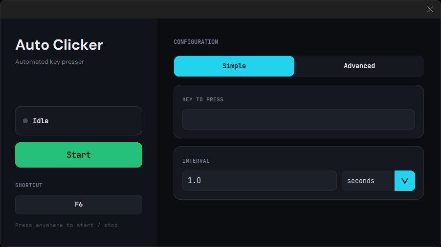
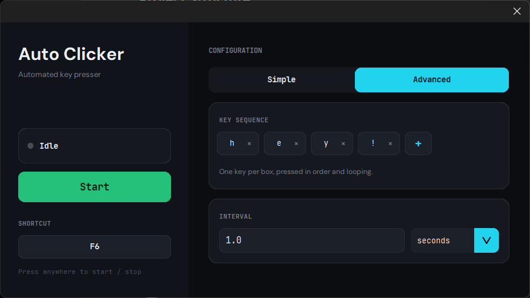
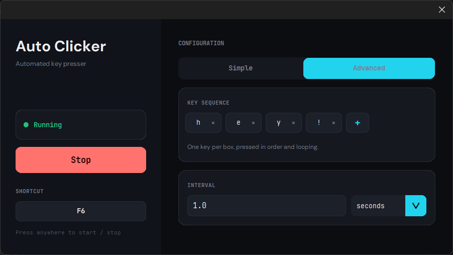

# AutoClicker

A lightweight and easy-to-use desktop application that automates key pressing tasks with customizable settings.

## Features

* Customizable key interval
* Start and stop key shortcut control
* Lightweight and fast
* User-friendly interface
* Offline operation
* Very low resource usage

## Screenshots

### Simple Mode

### Advanced Mode

### Running

---

## Installation

1. Download the latest release.
2. Run `AutoClicker.exe`.
3. Enjoy!

---

## Usage

1. Launch the application.
2. Set your preferred key interval (simple or advanced).
3. Configure any additional options.
4. Press **Start** or set key to begin auto-clicking.
5. Press **Stop** or set key to end the process.

---

## Controls

| Action   | Description               |
| -------- | ------------------------- |
| Start    | Begins automated clicking |
| Stop     | Stops automated clicking  |

---

## Requirements

* Windows
* Mouse and keyboard
* No internet connection required

---

## Additional Information

- This is the version 1 of the auto clicker, which focuses more on key press rather than mouse press.
- Succeeding versions will include the mouse press, with supported specific locations from the screen for abstact mouse location clicking (applied through X and Y coordinates).

---

## Known Issues

- The click/press will only work within the opened application.

---

## Disclaimer

This software is made free for everyone. Users are responsible for complying with the terms and conditions of any software where this application is downloaded and used.

---

## Author

**Made by Yukode**

Website: Website: https://yukode.netlify.app/
 
GitHub: https://github.com/Yukode
 
Project Link: https://github.com/Yukode/auto-clicker_releases
