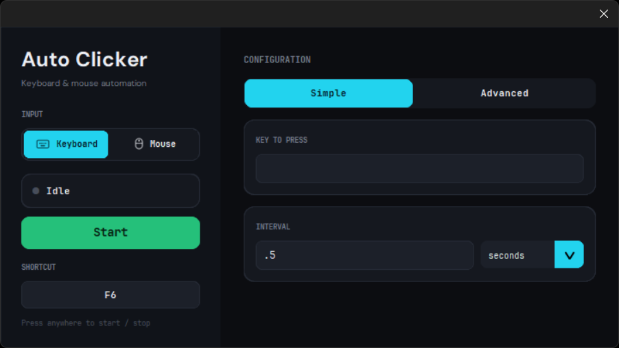
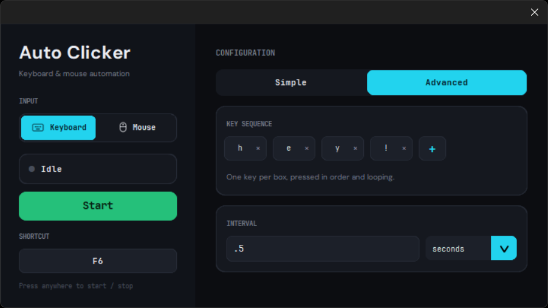
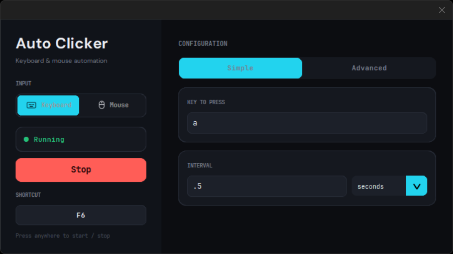
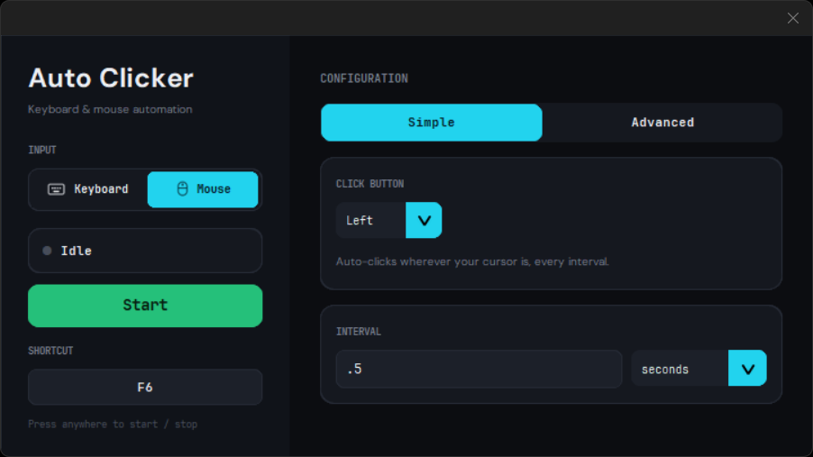
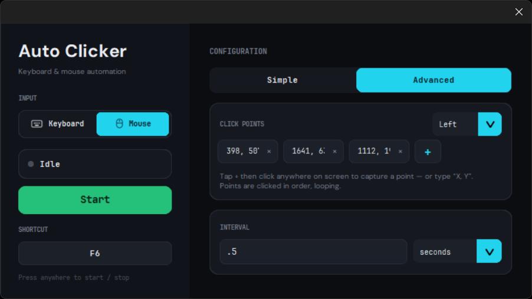

# AutoClicker

A lightweight and easy-to-use desktop application that automates key and mouse pressing tasks with customizable settings.

## Features

* Customizable key and mouse interval
* Start and stop key shortcut control
* Lightweight and fast
* User-friendly interface
* Offline operation
* Very low resource usage

## Screenshots

### Keyboard Clicker - Simple Mode

### Keyboard Clicker - Advanced Mode

### Keyboard Clicker - Running

### Mouse Clicker - Simple Mode

### Mouse Clicker - Advanced Mode

---

## Installation

1. Download the latest release.
2. Run `AutoClicker.exe`.
3. Enjoy!

---

## Usage

1. Launch the application.
2. Set your preferred key or mouse point interval (simple or advanced).
3. Configure any additional options.
4. Press **Start** or set key to begin auto-clicking.
5. Press **Stop** or set key to end the process.

---

## Controls

| Action   | Description               |
| -------- | ------------------------- |
| Start    | Begins automated clicking |
| Stop     | Stops automated clicking  |

---

## Requirements

* Windows
* No internet connection required

---

## Additional Information

- This is the version 2 of the auto clicker, with both mouse and key support.
- Version 2 update includes the major addition of the mouse feature, with both Simple and Advanced modes.
- Overall, the application has now the following features:
 &nbsp;&nbsp;&nbsp;&nbsp;&nbsp;&nbsp;**KEY CLICKER** 
&nbsp;&nbsp;&nbsp;&nbsp;&nbsp;&nbsp;&nbsp;&nbsp;&nbsp;&nbsp;&nbsp;&nbsp;- Simple Mode   : Press a single key per time set 
&nbsp;&nbsp;&nbsp;&nbsp;&nbsp;&nbsp;&nbsp;&nbsp;&nbsp;&nbsp;&nbsp;&nbsp;- Advanced Mode : Press multiple keys per time set in order 
&nbsp;&nbsp;&nbsp;&nbsp;&nbsp;&nbsp;**MOUSE CLICKER** 
&nbsp;&nbsp;&nbsp;&nbsp;&nbsp;&nbsp;&nbsp;&nbsp;&nbsp;&nbsp;&nbsp;&nbsp;- Simple Mode   : Press a single mouse click (cursor based) per time set 
&nbsp;&nbsp;&nbsp;&nbsp;&nbsp;&nbsp;&nbsp;&nbsp;&nbsp;&nbsp;&nbsp;&nbsp;- Advanced Mode : Press multiple mouse clicks (coordinates X and Y based) per time set in order  
- The Mouse Advanced mode allows the user to set their desired mouse point location to be clicked anywhere in their screen.
- Future versions of this application may happen, but this version is the most stable and currently maintained.

---

## Known Issues

- The click/press will only work within the opened application.

---

## Disclaimer

This software is made free for everyone. Users are responsible for complying with the terms and conditions of any software where this application is downloaded and used.

---

## Author

**Made by Yukode**
 
**See more of me:**

Website: https://yukode.netlify.app
 
GitHub: https://github.com/Yukode
 
Project Link: https://github.com/Yukode/auto-clicker_releases
